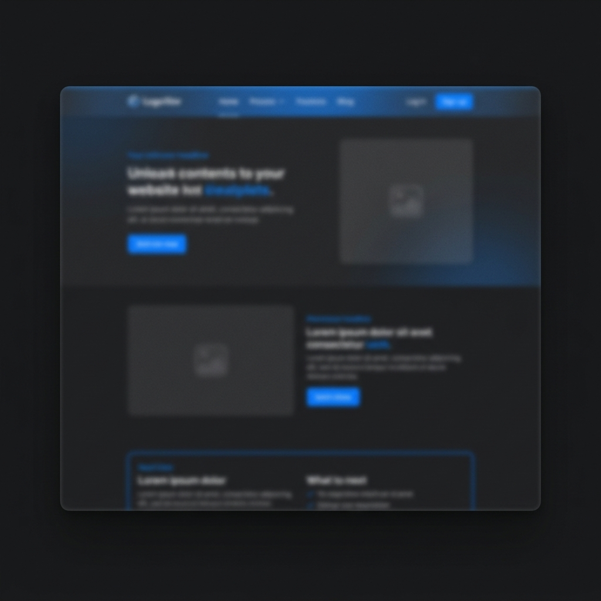

# PORTAFOLIO-ASTRO

## Descripción

Portafolio personal de **Yovanis Bossio**, desarrollado con **Astro**, **Tailwind CSS** y **TypeScript**. Combina un diseño oscuro con acentos azules, efectos de glow futurista y una interfaz interactiva que incluye:

- Emulador de línea de comandos en la sección Hero.
- Grid de habilidades con efectos de luz dinámicos.
- Formulario de contacto integrado con Web3Forms.
- Barra de progreso de scroll.
- Soporte multilingüe (español ↔ inglés) usando un sistema de traducciones centralizado.

## Demo



> _El sitio está desplegado en Netlify._\
> Visítalo: https://portafolio-dev-yovanisbossio.netlify.app

## Características

- **Diseño responsivo**: se adapta a mobile, tablet y desktop.
- **Tema oscuro con acentos azules** y efectos de glassmorphism.
- **CLI interactiva** que permite ejecutar comandos como `about`, `projects`, `skills`, `contact`.
- **i18n** completo con cambio de idioma.
- **Animaciones suaves** y micro‑interacciones.
- **Despliegue fácil** a Netlify o cualquier hosting estático.

## Tecnologías

| Categoría   | Tecnologías                                               |
| ----------- | --------------------------------------------------------- |
| Frontend    | Astro, Tailwind CSS, Alpine.js, TypeScript                |
| Formularios | Web3Forms                                                 |
| CI/CD       | Netlify                                                   |
| Icons       | Heroicons, Custom SVG components (LinkedIn, GitHub, etc.) |

## Instalación

```bash
# Clonar el repositorio
git clone https://github.com/Ymbossio/PORTAFOLIO-ASTRO.git
cd PORTAFOLIO-ASTRO

# Instalar dependencias
pnpm install

# Ejecutar en modo desarrollo
pnpm run dev
```

La aplicación estará disponible en `https://portafolio-dev-yovanisbossio.netlify.app/` (o el puerto que indique la consola).

## Build para producción

```bash
pnpm run build
# Los archivos estáticos se generarán en ./dist
```

## Uso del CLI interno

En la sección Hero, escribe comandos como:

- `about` – Información personal.
- `projects` – Lista de proyectos.
- `skills` – Visualiza la cuadrícula de habilidades.
- `contact` – Desplaza al formulario de contacto.
- `clear` – Limpia la salida.

## Contribuir

1. Fork el repositorio.
2. Crea una rama (`feature/nueva-funcionalidad`).
3. Envía un Pull Request describiendo los cambios.

## Licencia

Este proyecto está bajo la licencia MIT. Consulta el archivo `LICENSE` para más detalles.

## Contacto

- **LinkedIn**: https://linkedin.com/in/yovanis-bossio
- **Email**: Yovanis2001@gmail.com

---

_¡Gracias por visitar mi portafolio!_
